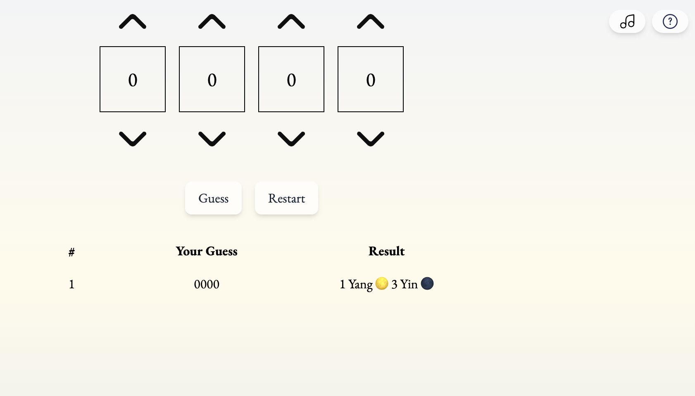

# 🌊 eternal-spring

A tranquil number-guessing mini game inspired by the classic Chinese RPG **Xuan-Yuan Sword: The Scar of Sky (轩辕剑叁外传：天之痕)**.

While building this project, I traced the game's core logic back to the traditional "Bulls and Cows" game — a discovery that added an extra layer of connection to this nostalgic journey.

<p align="center"><i>A preview of the mini game: </i></p>



---

## 🖥️ Demo

[eternal-spring app](eternal-spring.netlify.app)

🌿 Best experienced with sound on for a full atmosphere immersion.

## 🛠️ Tech Stack

- React@19 + Vite
- Tailwind CSS
- Deployed w/ Netlify

## 🚀 Getting Started

```bash
$ git clone https://github.com/yjie10/eternal-spring
$ cd eternal-spring
$ npm install
$ npm run dev
```

Open http://localhost:5173 to view it in the browser.

## ⚙️ Features

- Gentle background music, with mute/unmute control 🎶
- 4 unique digits generated each round 🎲
- Feedback system: _yang_ 🌕 for correct number & position, _yin_ 🌑 for correct number but wrong position ☯️
- Game instructions accessible anytime via modal 📜
- Restart the game or return to title screen anytime 🔄

## 💬 About

This project was created as a lighthearted exercise to polish React fundamentals, practice component structuring and design an interactive mini-world.

Again, special thanks to the nostalgic inspiration from the classic RPG -- **Xuan-Yuan Sword: The Scar of Sky (轩辕剑叁外传：天之痕)**.

The background music is directly borrowed from the number guessing mini-game map, bringing a personal touch of memory into this project.
